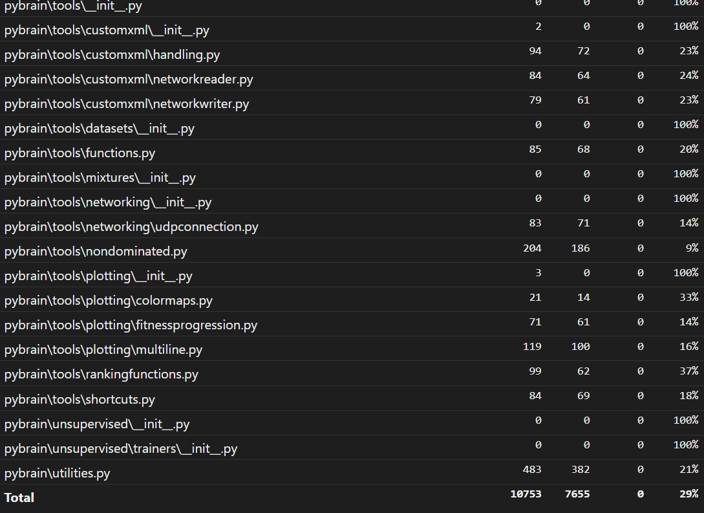
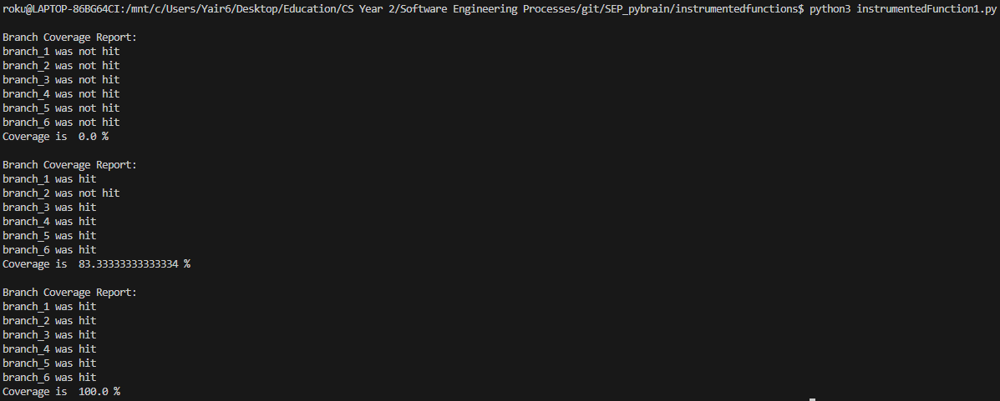
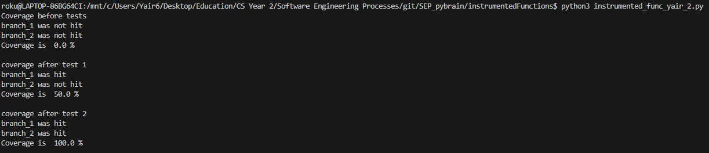
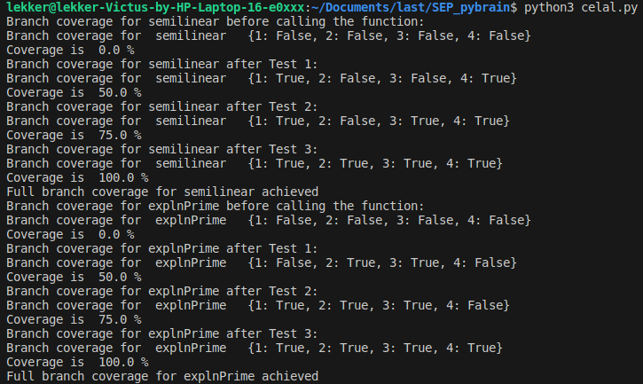
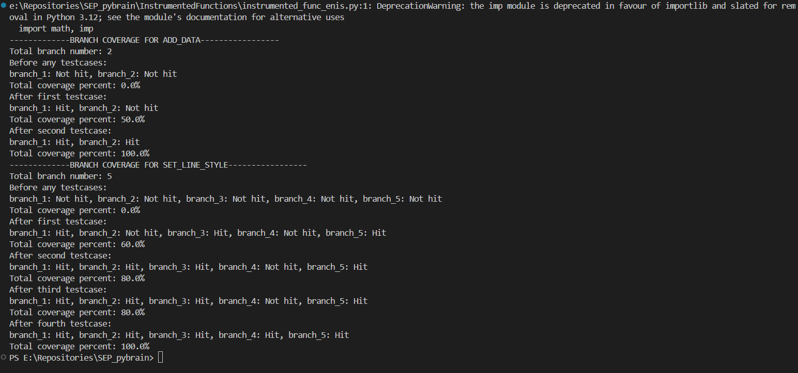
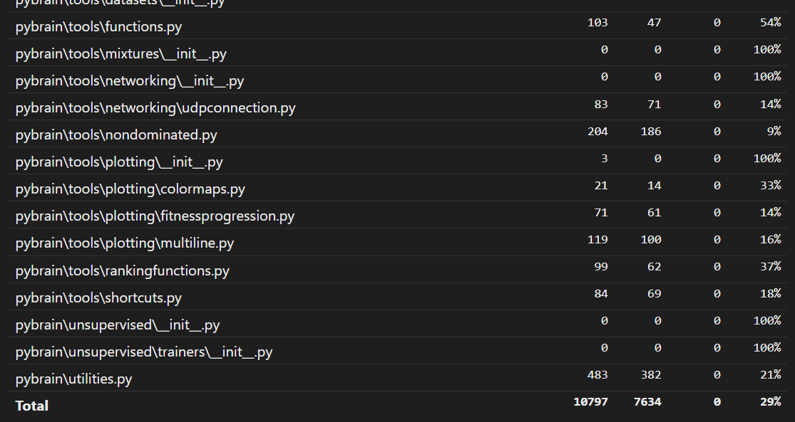
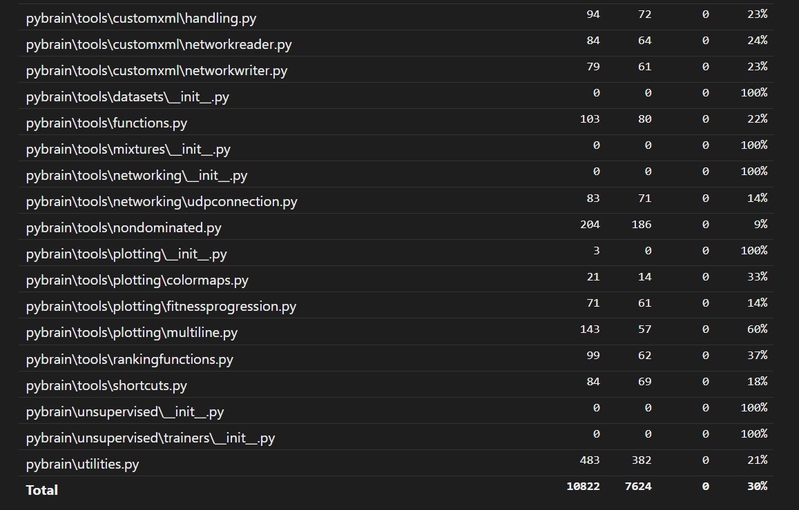

# Report for Assignment 1

## Project chosen

Name: pybrain

URL: https://github.com/pybrain/pybrain

Number of lines of code and the tool used to count it: 27148 (lizard)

Programming language: Python

## Coverage measurement

### Existing tool

We used Coverage.py as the existing tool to check the coverage of our forked project.
It was executed by the command `coverage run -m unittest discover `

### Your own coverage tool
#### Yaïr Jacob
getAction()
https://github.com/24x6fhy/SEP_pybrain/commit/b3d11cd991ae373f2a1c8d62f4a3cca4b9b841b0

Listen()
https://github.com/24x6fhy/SEP_pybrain/commit/b3d11cd991ae373f2a1c8d62f4a3cca4b9b841b0

#### Celal Turkmen
semilinear(x) and explnPrime(x) from pybrain/tools/functions.py \
[Relevant commit](https://github.com/24x6fhy/SEP_pybrain/commit/4f6d168feb45c2e99709aa0c82eaede21168f136) \
Code output: \

#### Enis Kerem Cakmak
addData(self, id0, x, y) and setLineStyle(self, id=None, **kwargs) from pybrain\tools\plotting\multiline.py \
[Relevant commit](https://github.com/24x6fhy/SEP_pybrain/commit/8638ffb2020cae48d70d25936c0262559df276e0) \
Code output: \

## Coverage improvement

### Individual tests

<The following is supposed to be repeated for each group member>

<Group member name>

<Test 1>

<Show a patch (diff) or a link to a commit made in your forked repository that shows the new/enhanced test>

<Provide a screenshot of the old coverage results (the same as you already showed above)>

<Provide a screenshot of the new coverage results>

<State the coverage improvement with a number and elaborate on why the coverage is improved>

<Test 2>

<Provide the same kind of information provided for Test 1>

#### Celal Turkmen

Note: Test 1 & 2 are both in the same file, so I did not make it separately.

Old coverage: \

New coverage: \

Covered statements are increased from 10753 to 10797. This is because test_celal.py file under test/unittest folder includes some test cases covering the statements in tools/functions.py.

### Overall
Old Coverage:

#### Enis Kerem Cakmak

Note: Test 1 & 2 are both in the same file, that is, multiline.py.

Old coverage: \

New coverage: \

As it is seen from the screenshots, the coverage is improved from 10753 to 10822 as a result of the new test cases added under pybrain\tests\unittests\tools\test_enis.py covering the selected function statements in pybrain\tools\plotting\multiline.py.

### Overall
Old Coverage:

<Provide a screenshot of the new coverage results by running the existing tool using all test modifications made by the group>

## Statement of individual contributions

### Celal Turkmen
- Found the project and checked if it meets the requirements.
- Instrumented the aforementioned functions.
- Showed the improvement of the coverage thanks to the instrumented functions in the report.
- Completed my own part in the report.

### Enis Kerem Cakmak
- Selected the individual functions to be tested.
- Instrumented the functions with custom coverage tool.
- Improved existing coverage with the new testcases and instrumented functions added.
- Finished the necessary report part.
