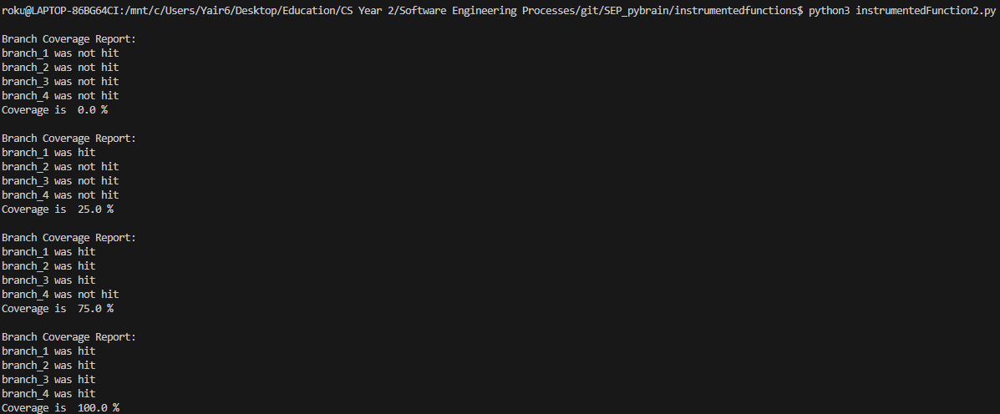

# Report for Assignment 1

## Project chosen

Name: pybrain

URL: https://github.com/pybrain/pybrain  ->> !!! We need to put our fork? or original git?

Number of lines of code and the tool used to count it: 158447 (lizard)

Programming language: Python

## Coverage measurement

### Existing tool

We used Coverage.py as the existing tool to check the coverage of our forked project.
It was executed by the command `coverage run -m unittest discover `


Yaïr Jacob
getAction()
https://github.com/24x6fhy/SEP_pybrain/commit/b3d11cd991ae373f2a1c8d62f4a3cca4b9b841b0


Listen()
https://github.com/24x6fhy/SEP_pybrain/commit/b3d11cd991ae373f2a1c8d62f4a3cca4b9b841b0


Celal Turkmen
semilinear(x) and explnPrime(x) from pybrain/tools/functions.py
Code output:
```
Branch coverage for semilinear before calling the function: 
Branch coverage for  semilinear   {1: False, 2: False, 3: False, 4: False}
Coverage is  0.0 %
Branch coverage for semilinear after Test 1: 
Branch coverage for  semilinear   {1: True, 2: False, 3: False, 4: True}
Coverage is  50.0 %
Branch coverage for semilinear after Test 2: 
Branch coverage for  semilinear   {1: True, 2: False, 3: True, 4: True}
Coverage is  75.0 %
Branch coverage for semilinear after Test 3: 
Branch coverage for  semilinear   {1: True, 2: True, 3: True, 4: True}
Coverage is  100.0 %
Full branch coverage for semilinear achieved
Branch coverage for explnPrime before calling the function: 
Branch coverage for  explnPrime   {1: False, 2: False, 3: False, 4: False}
Coverage is  0.0 %
Branch coverage for explnPrime after Test 1: 
Branch coverage for  explnPrime   {1: False, 2: True, 3: True, 4: False}
Coverage is  50.0 %
Branch coverage for explnPrime after Test 2: 
Branch coverage for  explnPrime   {1: True, 2: True, 3: True, 4: False}
Coverage is  75.0 %
Branch coverage for explnPrime after Test 3: 
Branch coverage for  explnPrime   {1: True, 2: True, 3: True, 4: True}
Coverage is  100.0 %
Full branch coverage for explnPrime achieved
```

## Coverage improvement

### Individual tests

<The following is supposed to be repeated for each group member>

<Group member name>

<Test 1>

<Show a patch (diff) or a link to a commit made in your forked repository that shows the new/enhanced test>

<Provide a screenshot of the old coverage results (the same as you already showed above)>

<Provide a screenshot of the new coverage results>

<State the coverage improvement with a number and elaborate on why the coverage is improved>

<Test 2>

<Provide the same kind of information provided for Test 1>

### Overall

<Provide a screenshot of the old coverage results by running an existing tool (the same as you already showed above)>

<Provide a screenshot of the new coverage results by running the existing tool using all test modifications made by the group>

## Statement of individual contributions

<Write what each group member did>
